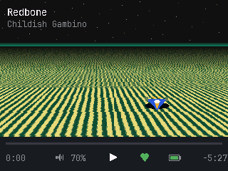
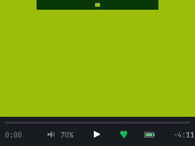
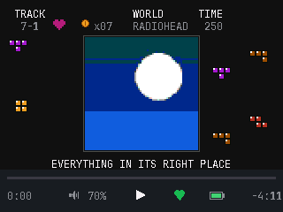
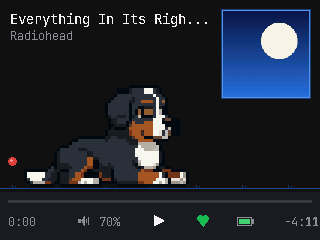
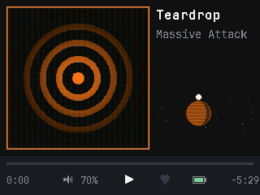
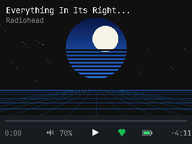
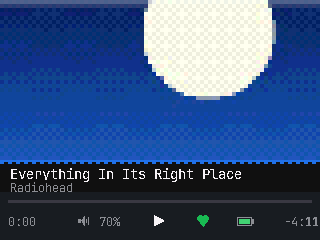
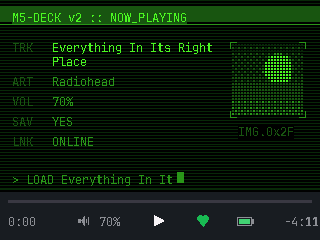
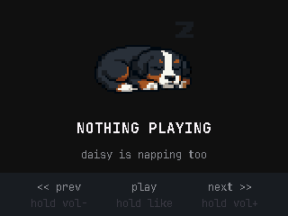
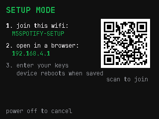

# M5Stack Spotify Desk Controller

A desk appliance that shows what's playing on Spotify — album art, track info,
and a small zoo of retro-themed views — with three physical buttons for
playback control. Runs on a **M5Stack Core Basic v2.7** (ESP32, 320×240 LCD,
three tactile buttons), and also compiles to a desktop emulator that renders
the identical firmware source through SDL.

There is a Bernese Mountain Dog in it. Her name is Daisy. She naps when
nothing is playing, gets the zoomies when the volume is high, and runs a
victory lap across the screen when you like a song.



| | |
|---|---|
|  |  |
| Game Boy: DMG boot, four greens, ordered dither | NES: the HUD in the real 2C02 palette, Tetris in the margins |
|  |  |
| Daisy's room (wait for the ball) | Classic — like a song and she does a lap |
|  |  |
| Synthwave: sinking sun, shooting stars | Pixel: CRT shimmer over the cover |
|  |  |
| Cyberdeck: live event log | Nothing playing |

*(Every frame above is the actual firmware rendering — captured from the
emulator, which runs the same source as the device. `tools/make_gifs.py`
regenerates them.)*

## What it does

- **Eight views**, rotating per track (or pinned): classic, pixel-art,
  Game Boy, cyberdeck terminal, synthwave horizon, Daisy's room, SNES Mode 7,
  NES HUD.
- **A shared transport strip** on every view: tinted progress bar with a comet
  head, elapsed/remaining, an animated play/pause morph, an animated liked
  heart, battery, volume, and toasts. State reads identically everywhere.
- **Optimistic UI** with settle windows, so a button press responds instantly
  and an in-flight poll can't snap it back.
- **Album art cached on SD**, tint sampled from each cover and threaded
  through every view.
- **A setup portal**: hold the left button at power-on (or boot unconfigured)
  and the device opens a WiFi access point with a phone-friendly form for
  WiFi + Spotify credentials. No recompiling to move it to a new network.



### Buttons

| Button | Tap | Hold |
|---|---|---|
| A (left) | Previous track | Volume down (repeats) |
| B (middle) | Play / pause | Save to Liked Songs |
| C (right) | Next track | Volume up (repeats) |
| A + C together | | Cycle the view |
| A held at power-on | | Setup portal |

## Hardware

**M5Stack Core Basic v2.7.** Everything here has run for days on the real
board. Things learned on hardware that the emulator could not show, preserved
as source comments where they bit: the LCD and SD share one SPI bus (deadlock
if you touch SD inside a display transaction), there is no PSRAM (a 320×240
framebuffer does not fit — every view draws directly and repaints only what
changed), the IP5306 PMIC reports battery in 25% steps and its "charging" bit
is meaningless, and M5Unified never latches the boost converter, so an
unpatched device dies the instant USB is unplugged.

Also required:

- **MicroSD, FAT32, 16GB or smaller** for the art cache. Without it the
  device runs and says so; covers just don't render.
- **2.4GHz WiFi.** The ESP32 cannot see 5GHz. A 5GHz-only network is the
  single most common "stuck on CONNECTING" cause.
- **A USB-C data cable** for flashing (charge-only cables present no port).
- **The battery switch on the M5-Bottom module set to 1** if you want it to
  survive being unplugged. It ships set to 0, which is indistinguishable in
  software from having no battery at all.

## Quick start (device)

```sh
pio run -e esp32 -t upload && pio device monitor
```

Then either:

- **Portal path (no secrets in the build):** the device boots into SETUP
  MODE. Join the `M5SPOTIFY-SETUP` network from a phone (there's a QR), open
  `192.168.4.1`, enter WiFi and Spotify credentials. It reboots into player
  mode with everything stored in NVS. Hold the left button through power-on
  to reconfigure any time.
- **Developer path:** create `src/config/secrets.h` (see
  `src/config/secrets.h.example`) with `python3 tools/get_refresh_token.py` —
  run it in a real terminal; it prompts for the sensitive values itself and
  writes the file mode 0600. Compiled secrets act as the fallback for any
  field the portal hasn't stored.

The boot banner on the serial monitor reports reset reason, crash streak,
heap, SD, and PMIC state — it is the first thing to read when anything
misbehaves.

### Spotify app setup

You need a (free) Spotify developer app: <https://developer.spotify.com/dashboard>.
Notes that will save you an afternoon:

- **Development Mode allows 5 users.** Add each listener's email in the
  dashboard under User Management.
- The **app owner needs active Premium** or every device stops working.
- Post-February-2026 apps must use the new library endpoints
  (`/me/library`, `/me/library/contains`, addressed by Spotify URI). The old
  `/me/tracks` answers 403 with no explanation, indistinguishable from a
  scope problem. This firmware already does the right thing.
- `/audio-features` and `/audio-analysis` are 403 in Dev Mode, which is why
  nothing here pretends to be beat-synced.

## The emulator

The emulator is not a mockup — it is the same firmware source compiled for
your desktop, rendering through SDL at the real 320×240. It deliberately
reproduces the awkward parts of the real thing: commands take effect after a
simulated 250ms round trip, state publishes every 2 seconds, and the progress
bar extrapolates locally in between.

```sh
brew install platformio sdl2 pkg-config     # one time (macOS)
export HOMEBREW_PREFIX=/opt/homebrew        # Apple Silicon

pio run -e native && ./.pio/build/native/program
```

With `src/config/secrets.h` present it drives your real Spotify; without it,
deterministic offline fixtures. `EMU_FAKE=1` forces fixtures either way.

Keyboard: `←`/`A` prev (hold: vol down), `Space`/`S` play-pause (hold: like),
`→`/`D` next (hold: vol up).

### Review harness

```sh
./tools/harness.sh          # fixtures, offline, deterministic
./tools/harness.sh --live   # your real Spotify
```

Every state and animation on demand, rather than waiting for a track to end
or the network to fail on its own:

| Key | |
|---|---|
| `1`..`8` | Pin a view: classic, pixel, gameboy, cyberdeck, synthwave, daisy, snes, nes |
| `0` | Unpin — rotate per track again |
| `[` `]` | Previous / next fixture track |
| `,` `.` | Scrub ±10s |
| `m` | Jump to near the end |
| `p` | Play / pause (fires the glyph morph) |
| `f` | Toggle like (fires the heart, and Daisy's lap) |
| `v` `b` | Volume ∓5 |
| `t` | Fire a toast |
| `n` | Cycle link state |
| `k` | Toggle "nothing playing" |
| `d` | Cycle brightness |
| `q` | Quit |

`Panel_sdl` binds bare `1`–`6` to window zoom and `r`/`l` to rotation; the
harness moves those behind `Ctrl` so picking a view doesn't resize the
window. The harness is `EMU_HARNESS`-gated and entirely inside
`#if defined(EMULATOR)`; the device build is byte-identical without it.

### Environment hooks

Every state is reachable headlessly, which is what the visual tests are
built on:

| Variable | Effect |
|---|---|
| `EMU_FAKE=1` | Offline fixtures instead of live Spotify |
| `EMU_TRACK=<n>` | Start on fixture *n* (0–4) |
| `EMU_MODE=<0-7>` | Pin one view (0 = classic) |
| `EMU_SCENE=<0-2>` | Pin one ambient scene |
| `EMU_LINK=<connecting\|offline\|autherror\|reauth\|notrack>` | Force a link state |
| `EMU_TOAST=<text>` | Raise a toast at startup |
| `EMU_FIRE=<like\|unlike\|playpause>` + `EMU_FIRE_MS` | Fire a user action at a known time |
| `EMU_BATTERY=<pct>` | Override the battery reading |
| `EMU_ARTLOADING=1` | Render every cover as still-downloading |
| `EMU_PORTAL=1` | Preview the setup-portal screen |
| `EMU_DIM_AFTER_MS` / `EMU_SLEEP_AFTER_MS` | Shorten the dim/sleep timers |
| `EMU_DUMP=<path>` | Write the framebuffer as a 24-bit BMP |
| `EMU_DUMP_EVERY_MS` + `EMU_DUMP_COUNT` | Dump a numbered frame sequence from one run (feeds `tools/make_gifs.py`) |
| `EMU_EXIT_MS=<ms>` | Quit after wall-clock ms |
| `SPOTIFY_DEBUG=1` / `SPOTIFY_DIAG=1` | HTTP logging / one-shot endpoint probe (never tokens) |

```sh
# Capture a specific case as a PNG
EMU_FAKE=1 EMU_MODE=6 EMU_DUMP=/tmp/f.bmp EMU_EXIT_MS=2800 ./.pio/build/native/program
sips -s format png /tmp/f.bmp --out /tmp/f.png
```

## Tests

Two layers, both in CI (`.github/workflows/ci.yml`, Linux + xvfb):

```sh
pio test -e test                 # 26 host unit tests: merge policy, deadlines,
                                 # wrap-safety, button logic, text wrapping
python3 tools/visual_tests.py    # 32 pixel-assertion checks against real
                                 # emulator framebuffers
```

The visual tests assert on properties, not golden images — "the heart is
green after a like", "the strip has no residue after Daisy's lap", "every
view shows play state, heart, bar, volume and battery" (that one loops all
eight views). Every display bug found in this project was invisible to logic
tests and obvious in a screenshot.

Known flake: M5GFX's SDL backend has an unsynchronised startup race
(`Panel_sdl::init()` pushes onto a list the render thread is iterating).
Roughly 1 run in 80 segfaults at startup, emulator-only. The suite retries
three times and reports how often it did.

## Architecture, briefly

```
src/
  core/      AppState, merge policy, wrap-safe Deadline, device config, hash
  net/       NetWorker (FreeRTOS task, core 0), WifiLink, HTTP interface
  spotify/   Web API source: auth refresh, polling, commands, art fetch
  art/       SD cache (bounded, oldest-evicted), JPEG decode, tint sampling
  ui/        views, shared StatusStrip, scenes, Daisy, fonts, theme
  platform/  esp32/ and native/ implementations of the same interfaces
  sources/   offline fixture source (what the emulator uses without secrets)
```

- The net task **snapshots state under a mutex, does all I/O lock-free, then
  merges back** under the same mutex. The UI never blocks on the network.
- Every timer is elapsed-based (`Deadline`), so nothing inverts at the
  49.7-day `millis()` wrap.
- The hardware watchdog covers the render loop only; the net task (which may
  legitimately block for seconds) has a heartbeat and is restarted if it
  genuinely wedges. This distinction was learned the hard way — see the
  comment in `src/core/Diag.h`.
- Poll cadence: 2s playing, 5s paused, 20s with the screen asleep; a button
  wake polls immediately.
- Sprite buffers store RGB565 **byte-swapped**. Any arithmetic on raw pixels
  must unswap first. This has bitten twice; the comments mark where.
- TLS validates against the ESP-IDF root CA bundle; keep-alive sessions are
  reused per host and rebuilt once when the server's idle close poisons them.

## Daisy

The sprites are 55×41 pixel art, ten animations, stored 8-bit indexed in
flash (~88KB total) and drawn with a frame-to-frame cell diff — no sprite
RAM, no flicker. `tools/daisy_convert.py` regenerates
`src/ui/daisy/DaisyAssets.h` from the GIFs in the repo root, so you can swap
in your own dog. She picks her activity per track (deterministic hash, so she
has opinions about songs), sleeps on pause, zoomies above 85% volume, and
sprints across the strip when a song gets liked.

## Power

Runs indefinitely on USB-C. On the internal battery expect tens of minutes —
the Core Basic's cell is ~110mAh and this firmware keeps WiFi and the
backlight up; it's a carry-it-to-the-kitchen battery, not an afternoon one.
The strip's battery glyph shows four levels because the PMIC genuinely cannot
resolve more than that. The screen dims after 30s idle and sleeps when
nothing has played for a while; any button wakes it (the waking press is
swallowed, like a phone).

## Regenerating fixture album art

```sh
python3 tools/make_fixture_art.py assets/art
for f in assets/art/*.png; do
  sips -s format jpeg -s formatOptions 82 "$f" --out "${f%.png}.jpg"
done
rm -f assets/art/*.png
```

Dependency-free by design: a minimal PNG encoder over `zlib`, then macOS
`sips` for JPEG, rather than requiring Pillow for five placeholder images.

## License

MIT — see [LICENSE](LICENSE). The Daisy sprites are of a real (very good)
dog, included with her owner's blessing.
