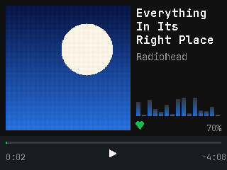
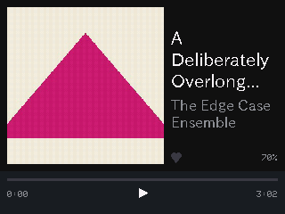
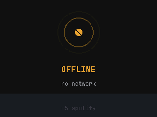
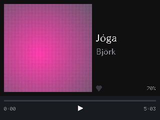

# M5Stack Spotify Desk Controller

A permanently-plugged-in desk appliance showing Spotify album art and now-playing
info, with three physical buttons for playback control.

Target hardware: **M5Stack Core Basic v2.7** (ESP32, 320×240, three tactile
buttons). Not yet purchased — the emulator below exists so the UI can be judged
first.

Design spec: [`docs/superpowers/specs/2026-08-05-m5stack-spotify-controller-design.md`](docs/superpowers/specs/2026-08-05-m5stack-spotify-controller-design.md)

## Running the emulator

The emulator is not a mockup. It is the **same firmware source** compiled for
your Mac, rendering through SDL at the real 320×240, so what you see is what the
panel will show.

```sh
brew install platformio sdl2 pkg-config     # one time
export HOMEBREW_PREFIX=/opt/homebrew        # Apple Silicon

pio run -e native && ./.pio/build/native/program
```

### Controls

| Key | Button | Tap | Hold |
|---|---|---|---|
| `←` or `A` | A | Previous track | Volume down (repeats) |
| `Space` or `S` | B | Play / pause | Save to Liked Songs |
| `→` or `D` | C | Next track | Volume up (repeats) |

The emulator plays through five fixture tracks with real JPEG cover art. It
deliberately reproduces the awkward parts of the real thing: commands take effect
after a simulated 250ms API round trip, state is only published every 2 seconds,
and the progress bar is extrapolated locally in between.

Leave it alone for 30 seconds to watch it dim; the sleep timer needs 3 minutes of
nothing playing.

### Environment hooks

| Variable | Effect |
|---|---|
| `EMU_FAKE=1` | Use offline fixtures instead of live Spotify |
| `EMU_TRACK=<n>` | Start on fixture *n* (0–4) |
| `EMU_EXIT_MS=<ms>` | Quit after wall-clock ms — use this when waiting on the network |
| `SPOTIFY_DEBUG=1` | Log HTTP status codes and API errors (never tokens) |
| `SPOTIFY_DIAG=1` | Probe several endpoints once and log their statuses |
| `EMU_TOAST=<text>` | Raise a toast at startup, to inspect the toast row without a keypress |
| `EMU_FIRE=<like\|unlike\|playpause>` | Fire a user action at a known time, to sample animations |
| `EMU_FIRE_MS=<ms>` | When `EMU_FIRE` triggers (default 500) |
| `EMU_LINK=<connecting\|offline\|autherror\|reauth\|notrack>` | Force a link state to inspect the status screen |
| `EMU_DUMP=<path>` | Write the framebuffer as a 24-bit BMP |
| `EMU_EXIT_AFTER=<n>` | Quit after *n* frames. Note `loop()` runs as fast as SDL allows, so this is **not** a wall-clock proxy — prefer `EMU_EXIT_MS` when waiting on the network |

```sh
# Capture a specific case as a PNG
EMU_TRACK=2 EMU_DUMP=/tmp/f.bmp EMU_EXIT_AFTER=90 ./.pio/build/native/program
sips -s format png /tmp/f.bmp --out /tmp/f.png
```

## Screenshots

Captured from the emulator at native 320×240.

| | |
|---|---|
|  |  |
| Normal playback | A long title truncating |



The status screen. `CONNECTING` is accent-coloured with a clean core; faults
are amber with a slash through it, so a normal wait and a real problem are
distinguishable without relying on colour alone.



Accented text, which is why the fonts are the Unicode `lgfxJapanGothicP` faces
rather than Adafruit's ASCII-only FreeSans.

## Tests

```sh
./tools/run_tests.sh
```

Two layers, because they catch different things:

- **`pio test -e test`** — 22 host unit tests over the display-free logic:
  button state machine, command coalescing, the progress clock, the merge
  policy's settle windows, time formatting. No SDL, no M5GFX, runs in seconds.
- **`tools/visual_tests.py`** — 11 checks that run the emulator headlessly and
  assert on real framebuffer pixels.

The visual layer is not optional. Every rendering bug this project has hit was
invisible to logic tests and obvious in a screenshot: toast text ghosting under
the timecodes, the play glyph vanishing after a like, the clock stuttering in
two-second steps. Each of those now has a test named after the symptom.

No golden images — they rot whenever a colour or font changes. The checks
assert properties that should hold regardless ("no amber pixels remain in the
info row after a toast expires").

## The visualiser

Decorative, and deliberately not pretending otherwise.

The device never touches the audio stream, the Core Basic has no microphone,
and Spotify's `/audio-features` and `/audio-analysis` both return **403** for
this app tier — verified, not assumed. There is no tempo, energy or spectrum
available at any price, so nothing here can react to the music.

What it does instead is tie everything it *can* to real state:

- **Colour is sampled from the album art**, so it changes with every record
  (brightness-normalised, so a dark sleeve still yields a readable tint).
- **Amplitude follows the real volume.**
- **The bars settle flat when playback actually pauses.**

The motion itself is layered sine waves. A fixed fake BPM was considered and
rejected: a pulse locked to the wrong tempo reads as broken, while smooth
motion reads as ambient.

## Live Spotify

With `src/config/secrets.h` present the emulator uses the real Web API; without
it, offline fixtures. `EMU_FAKE=1` forces fixtures either way.

```sh
python3 tools/get_refresh_token.py    # in a REAL terminal, not an agent session
```

Networking runs on its own thread, mirroring the design's core-0 net task — a
Spotify call takes 200-500ms and must never block rendering.

**Development Mode apps must use the post-February-2026 library endpoints**
(`/me/library`, `/me/library/contains`, addressed by Spotify URI). The old
`/me/tracks` equivalents are deprecated and answer 403 with no explanation,
which is indistinguishable from a scope problem. See the spec for the full
diagnosis. Note also that the app owner needs active Premium or the app stops
working entirely.

## Building for hardware

```sh
pio run -e esp32 -t upload
```

Not yet functional: the device build still needs `SpotifySource` (real Web API),
`WifiLink`, `SpotifyAuth`, the SD artwork cache, and `src/config/secrets.h`.
See the spec's build order.

## Layout

Geometry lives in `src/ui/Theme.h`. `ART_SIZE` drives every other coordinate, so
the spec's 160/150 artwork fallbacks are a one-constant change.

```
+----------------------------------------+
|  +------------+    Song Title That     |   art:   (8, 8)   176x176
|  |            |    Wraps To Three      |   text:  (192, 8) 120x176
|  |  album art |    Lines Max           |
|  |  176 x 176 |                        |
|  |            |    Artist Name         |
|  +------------+    <3          70%     |
+----------------------------------------+
|  ==================--------            |   strip: (0, 192) 320x48
|  1:47                          3:52    |   opaque
+----------------------------------------+
```

## Regenerating fixture album art

```sh
python3 tools/make_fixture_art.py assets/art
for f in assets/art/*.png; do
  sips -s format jpeg -s formatOptions 82 "$f" --out "${f%.png}.jpg"
done
rm -f assets/art/*.png
```

Dependency-free by design: a minimal PNG encoder over `zlib`, then macOS `sips`
for JPEG, rather than requiring Pillow for five placeholder images.
